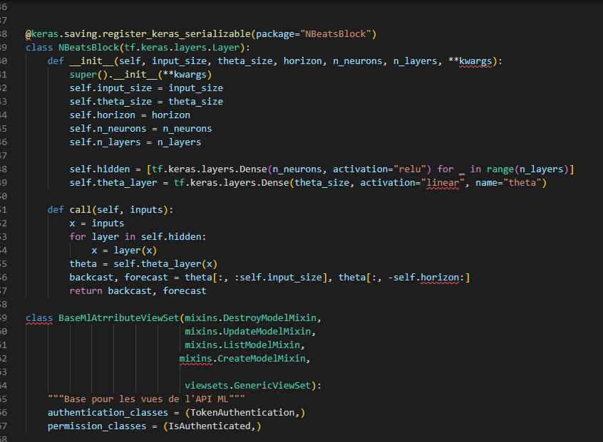

# MLModels API - MLOps with MLflow

This project provides an API for managing machine learning models, including uploading models, predicting results using uploaded models, and managing metadata. The API is built using Django and Django Rest Framework (DRF), with integrations for MLOps using MLflow.

## Features

- **Model Management:** Upload, update, delete, and retrieve machine learning models.
- **Prediction API:** Predict outcomes using uploaded models.
- **MLOps Integration:** Leverage MLflow for model tracking and lifecycle management.

## API Overview

The API provides the following endpoints:

### Endpoints for `AppData`

- **`/api/ml/AppData/`**
  - `GET`: Retrieve all data.
  - `POST`: Create a new data entry.
- **`/api/ml/AppData/{id}/`**
  - `GET`: Retrieve a specific data entry by ID.
  - `PUT`: Update an existing data entry by ID.
  - `PATCH`: Partially update an existing data entry by ID.
  - `DELETE`: Delete a specific data entry by ID.

### Endpoints for `Appariels`

- **`/api/ml/appariels/`**
  - `GET`: Retrieve all apparatus entries.
  - `POST`: Create a new apparatus entry.
- **`/api/ml/appariels/{id}/`**
  - `GET`: Retrieve a specific apparatus entry by ID.
  - `PUT`: Update an existing apparatus entry by ID.
  - `PATCH`: Partially update an existing apparatus entry by ID.
  - `DELETE`: Delete a specific apparatus entry by ID.

### Endpoints for `MLModels`

- **`/api/ml/mlmodel/`**
  - `GET`: Retrieve all machine learning models.
  - `POST`: Upload a new machine learning model.
- **`/api/ml/mlmodel/{id}/`**
  - `GET`: Retrieve a specific machine learning model by ID.
  - `PUT`: Update an existing machine learning model by ID.
  - `PATCH`: Partially update an existing machine learning model by ID.
  - `DELETE`: Delete a specific machine learning model by ID.

### Endpoints for Prediction

- **`/api/ml/predict/`**
  - `POST`: Make a prediction using a specific model and input data.
  - 

## Example Request

Here's an example of how to use the API to send data for prediction.

```bash
curl -X POST "http://localhost:8000/api/ml/predict/" \
-H "Content-Type: application/json" \
-H "Authorization: Token <your_token>" \
-d '{
    "model_name": "YourModelName",
    "data": [1, 2, 3, 4, 5, ... 72]
}'
```


## Swagger UI

You can interact with the API using the Swagger UI, which provides a user-friendly interface for testing API endpoints.

  <!-- Update with your local image path -->

